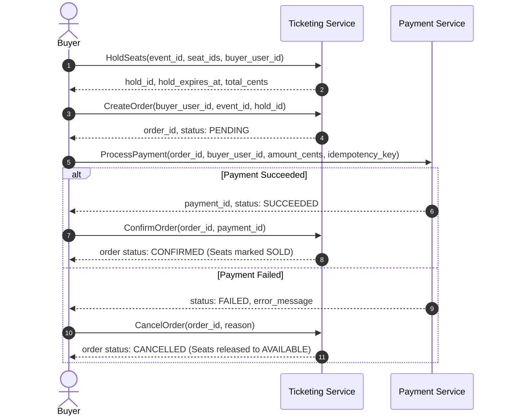

# Microservices Architecture & gRPC Operations Specification

This document outlines all gRPC services, RPC operations, request/response payloads, and enums needed to implement the Ticketmaster-style ticketing system according to [`database/schema.sql`](file:///home/yuri/Data/projects/ticketing/database/schema.sql).

---

## 1. System Overview & End-to-End Booking Flow



---

## 2. User Service (`proto/user.proto`)

Responsible for authentication, identity management, and user roles.

### Enums
```protobuf
enum UserRole {
  USER_ROLE_UNSPECIFIED = 0;
  USER_ROLE_BUYER = 1;
  USER_ROLE_HOST = 2;
}
```

### RPC Operations

| RPC Method | Request Message | Response Message | Description |
| :--- | :--- | :--- | :--- |
| `Register` | `RegisterRequest` | `RegisterResponse` | Creates a new user with hashed password and assigns a role. |
| `Login` | `LoginRequest` | `LoginResponse` | Validates credentials and returns an auth token (JWT) + user info. |
| `GetUser` | `GetUserRequest` | `GetUserResponse` | Retrieves user profile by unique ID. |
| `BatchGetUsers` | `BatchGetUsersRequest` | `BatchGetUsersResponse` | Fetches multiple user profiles by a list of IDs (for cross-service enrichment). |

### Message Definitions
* **`User`**: `id` (string), `username` (string), `email` (string), `role` (`UserRole`), `created_at` (`google.protobuf.Timestamp`)
* **`RegisterRequest`**: `username` (string), `email` (string), `password` (string), `role` (`UserRole`)
* **`RegisterResponse`**: `user` (`User`)
* **`LoginRequest`**: `email_or_username` (string), `password` (string)
* **`LoginResponse`**: `token` (string), `user` (`User`)
* **`GetUserRequest`**: `user_id` (string)
* **`GetUserResponse`**: `user` (`User`)
* **`BatchGetUsersRequest`**: `repeated string user_ids`
* **`BatchGetUsersResponse`**: `repeated User users`

---

## 3. Ticketing Service (`proto/ticketing.proto`)

Handles venues, sections, seats, event scheduling, price tiers, seat inventory reservation, and orders.

### Enums
```protobuf
enum SeatingMode {
  SEATING_MODE_UNSPECIFIED = 0;
  SEATING_MODE_ASSIGNED = 1;
  SEATING_MODE_GENERAL_ADMISSION = 2;
}

enum SeatStatus {
  SEAT_STATUS_UNSPECIFIED = 0;
  SEAT_STATUS_AVAILABLE = 1;
  SEAT_STATUS_HELD = 2;
  SEAT_STATUS_SOLD = 3;
}

enum OrderStatus {
  ORDER_STATUS_UNSPECIFIED = 0;
  ORDER_STATUS_PENDING = 1;
  ORDER_STATUS_CONFIRMED = 2;
  ORDER_STATUS_FAILED = 3;
  ORDER_STATUS_CANCELLED = 4;
}
```

### A. Venue & Topology Management (Host/Admin)

| RPC Method | Request Message | Response Message | Description |
| :--- | :--- | :--- | :--- |
| `CreateVenue` | `CreateVenueRequest` | `CreateVenueResponse` | Creates a static physical venue. |
| `GetVenue` | `GetVenueRequest` | `GetVenueResponse` | Retrieves venue details with its sections and seats. |
| `CreateSection` | `CreateSectionRequest` | `CreateSectionResponse` | Adds a named section to a venue. |
| `BatchCreateSeats` | `BatchCreateSeatsRequest` | `BatchCreateSeatsResponse` | Bulk generates seat labels (`row_label`, `seat_number`) for a section. |

### B. Event Lifecycle & Discovery

| RPC Method | Request Message | Response Message | Description |
| :--- | :--- | :--- | :--- |
| `CreateEvent` | `CreateEventRequest` | `CreateEventResponse` | Creates an event, configures price tiers, and initializes `seat_inventory` for assigned seating. |
| `GetEvent` | `GetEventRequest` | `GetEventResponse` | Fetches event details, price tiers, and remaining available count. |
| `ListEvents` | `ListEventsRequest` | `ListEventsResponse` | Searches/lists events with filters (city, date range, pagination). |
| `GetEventSeatInventory` | `GetEventSeatInventoryRequest` | `GetEventSeatInventoryResponse` | Retrieves the seat map with live status (`AVAILABLE`, `HELD`, `SOLD`) and tier info. |

### C. Concurrency, Holds & Ordering (Booking Flow)

| RPC Method | Request Message | Response Message | Description |
| :--- | :--- | :--- | :--- |
| `HoldSeats` | `HoldSeatsRequest` | `HoldSeatsResponse` | Concurrently locks seats or GA capacity with an expiration timestamp. |
| `ReleaseHold` | `ReleaseHoldRequest` | `ReleaseHoldResponse` | Releases a temporary hold before expiration (e.g. buyer checkout abandonment). |
| `CreateOrder` | `CreateOrderRequest` | `CreateOrderResponse` | Creates a `PENDING` order referencing an active `hold_id` and snapshots line item prices. |
| `ConfirmOrder` | `ConfirmOrderRequest` | `ConfirmOrderResponse` | Transitions order to `CONFIRMED`, marks seats as `SOLD`, and records `payment_id`. |
| `CancelOrder` | `CancelOrderRequest` | `CancelOrderResponse` | Cancels order upon payment failure or timeout, reverting seats to `AVAILABLE`. |
| `GetOrder` | `GetOrderRequest` | `GetOrderResponse` | Retrieves order details along with immutable `order_line_items`. |
| `ListUserOrders` | `ListUserOrdersRequest` | `ListUserOrdersResponse` | Lists order history for a buyer. |

---

## 4. Payment Service (`proto/payment.proto`)

Handles payment transactions, status lifecycles, and double-charge protection.

### Enums
```protobuf
enum PaymentStatus {
  PAYMENT_STATUS_UNSPECIFIED = 0;
  PAYMENT_STATUS_PENDING = 1;
  PAYMENT_STATUS_SUCCEEDED = 2;
  PAYMENT_STATUS_FAILED = 3;
  PAYMENT_STATUS_REFUNDED = 4;
}
```

### RPC Operations

| RPC Method | Request Message | Response Message | Description |
| :--- | :--- | :--- | :--- |
| `ProcessPayment` | `ProcessPaymentRequest` | `ProcessPaymentResponse` | Processes charge using an `idempotency_key` to guarantee safe retries. |
| `GetPayment` | `GetPaymentRequest` | `GetPaymentResponse` | Retrieves payment record by `payment_id` or `order_id`. |
| `RefundPayment` | `RefundPaymentRequest` | `RefundPaymentResponse` | Issues a refund if an order fails post-payment or gets cancelled. |

### Message Definitions
* **`Payment`**: `id` (string), `order_id` (string), `buyer_user_id` (string), `amount_cents` (int64), `currency` (string), `status` (`PaymentStatus`), `idempotency_key` (string), `created_at` (`google.protobuf.Timestamp`)
* **`ProcessPaymentRequest`**: `order_id` (string), `buyer_user_id` (string), `amount_cents` (int64), `currency` (string), `idempotency_key` (string), `payment_method_token` (string)
* **`ProcessPaymentResponse`**: `payment` (`Payment`), `error_message` (string)
* **`GetPaymentRequest`**: oneof identifier (`payment_id` or `order_id`)
* **`GetPaymentResponse`**: `payment` (`Payment`)
* **`RefundPaymentRequest`**: `payment_id` (string), `reason` (string)
* **`RefundPaymentResponse`**: `payment` (`Payment`)
